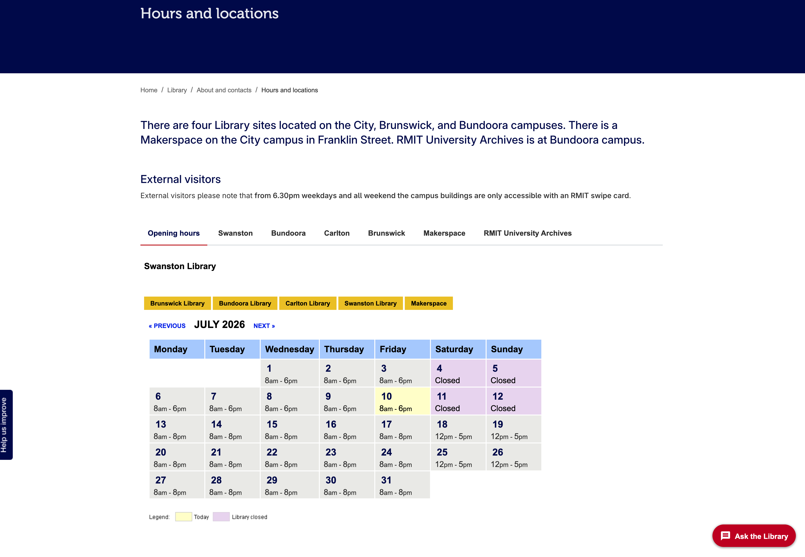

# Library Opening Hours Web Display 

This codebase powers the RMIT Library opening hours web display used on the Library homepage and the Library Hours and Locations page. It provides the authoritative public-facing display of opening hours for the Library’s campus locations, including day-by-day open and close times and operational notes. 

## Overview 

The application is a long-running custom PHP and MySQL solution hosted on the lib Jaguar server. It queries a MySQL database containing one row per day for each relevant opening-hours record and renders that data as HTML/CSS for embedding into Adobe Experience Manager pages via iframe. 

The system exists because opening hours need to be updated dynamically and reliably, including for routine timetable changes, study hall and makerspace variations, events, staffing changes, emergency changes, and other short-notice service adjustments. 

### 2026

Testing files are in /docs/ and published to github


## Key Files 

### open-hours-3col.php

Renders the Library homepage "today's opening hours" widget as a three-column snapshot, one column per pair of sites (Ask the Library/Brunswick, Bundoora/Carlton, Swanston/Makerspace).

For each site it runs a query of the form:

```sql
SELECT opening, closing, is_closed, ymd, is_semester, is_exam, notes
FROM `<site>_hours`
WHERE ymd = '<today's date>'
```

against six per-site tables (`asklibrary_hours`, `brunswick_hours`, `bundoora_hours`, `carlton_hours`, `swanston_hours`, `makerspace_hours`), each sharing the same structure as `brunswick_hours` shown below. It only ever fetches today's single row per table, and from it uses just `is_closed` (to print "CLOSED") and `opening`/`closing` (to print the hours) — `notes`, `is_semester`, and `is_exam` are selected but not used in this script.

### hoursNoBanner.php

Renders the full monthly calendar view seen in the screenshot below, for one site at a time. The site is chosen via a `?site=` query parameter (`swan`, `carl`, `make`, `bund`, `brun`), which is mapped to the corresponding `<site>_hours` table and display name; the month is chosen via `?m=` and `?c=` (current month plus/minus an offset, driving the "previous"/"next" links).

It queries the whole month in one go:

```sql
SELECT opening, closing, is_closed, ymd, is_semester, is_exam, notes
FROM `<site>_hours`
WHERE ymd LIKE '<year>-<month>-%'
ORDER BY ymd
```

then builds a Monday–Sunday HTML calendar grid, one `<td>` per day of the month. For each day it uses every column from the table structure below:

* `is_semester` / `is_exam` — set a CSS class (`semester` / `exam`) used to style the day differently during those periods.
* `is_closed` — set the `closed` class and print "Closed" instead of hours (this is the purple styling seen in the screenshot).
* the current day (matched against `is_closed`/today's date) gets the `hours_today` class (the yellow styling in the screenshot).
* `opening` / `closing` — printed as the hours text for the day, with "am"/"pm" wrapped in a smaller `<span>` for styling.
* `notes` — appended under the hours (or under "Closed") as free-text, e.g. for short-notice changes.

This is the script embedded via iframe as the "Hours and locations" page shown in the screenshot below — the tabs/links for each campus (Brunswick, Bundoora, Carlton, Swanston, Makerspace) are just links back into this same file with a different `site` parameter.

## How the Application Works 

* Opening-hours data is maintained in a MySQL database. 
* Each daily record includes opening time, closing time, and notes fields. 
* PHP scripts query the database and generate HTML/CSS output. 
* The generated output is embedded into RMIT web pages using an iframe. 
* The iframe is used on Adobe Experience Manager pages, including the Library homepage and Library Hours and Locations page. 

## Runtime Environment 

* Application host: lib Jaguar server 
* Public URL: https://lib.rmit.edu.au 
* Internal host reference: librprdws01.int.its.rmit.edu.au 
* Server stack: Red Hat Linux, PHP, and MySQL 
* Embedding environment: Adobe Experience Manager at https://rmit.edu.au 

## Screenshots

### Live opening-hours display



The rendered output as it appears on the RMIT Library "Hours and locations" page, embedded via iframe. This view shows the Swanston Library calendar for July 2026, with each day displaying its opening and closing times. Closed days (weekends, in this example) are highlighted in purple, and the current day is highlighted in yellow, per the legend at the bottom. Tabs above the calendar switch between the "Opening hours" summary view and individual campus locations (Swanston, Bundoora, Carlton, Brunswick, Makerspace, RMIT University Archives).

### Database table structure


The phpMyAdmin structure view for the `brunswick_hours` table on `librprddb02.int.its.rmit.edu.au`, one of the per-campus tables that back this display (see `brunswick_hours.sql` for the matching dump). Each row represents a single day and includes:

* `brunswick_hours_id` – auto-incrementing primary key.
* `ymd` – the date for the record.
* `opening` / `closing` – opening and closing times for that day.
* `is_closed` – flag indicating the location is closed on that date.
* `is_semester` – flag indicating the date falls within a semester period.
* `is_exam` – flag indicating the date falls within an exam period.
* `notes` – free-text notes shown alongside the hours (e.g. for short-notice service adjustments).

The other campus locations (Swanston, Bundoora, Carlton) follow the same table structure with their own tables.

## Current Known Issue 

Some users receive a browser prompt asking whether to allow or block local network access when loading the Library homepage or opening-hours page. Reports indicate this occurs most often when users are connected to the RMIT VPN or the Brunswick campus Wi-Fi network. 

The issue is believed to be consistent with modern browser Local Network Access or Private Network Access protections, where a public web page attempts to load a resource that resolves to private or internal network address space. Chrome documentation describes Local Network Access as a browser protection that requires user permission before a site can make requests to servers on a local network. This behaviour can affect iframe-based architectures where embedded content resolves to private address space. #INC0496661.

